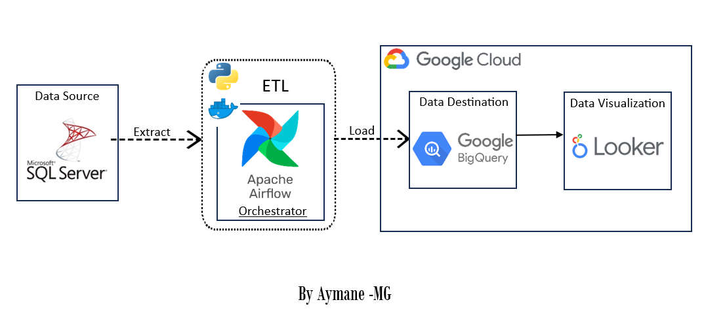

# Sales ETL Project 


## Table of Contents
1. [Project Overview](#project-overview)
3. [Technologies Used](#technologies-used)
4. [Data Pipeline](#data-pipeline)
5. [Repository Structure](#repository-structure)
6. [Prerequisites](#prerequisites)
7. [Configuration](#configuration)
8. [Running the Project](#running-the-project)
9. [Cleaning Up](#cleaning-up)
10. [Dashboard](#dashboard)
11. [Acknowledgments](#acknowledgments)
12. [Conclusion](#conclusion)
13. [Contacts](#contacts)

## Project Overview
This ETL (Extract, Transform, Load) project demonstrates the process of extracting data from a SQL Server database, transforming it using Python, orchestrating the data pipeline with Apache Airflow (running in a Docker container), loading the transformed data into Google BigQuery data warehouse, and finally creating a dashboard using Looker Studio.

## Technologies Used
The following technologies and tools were used in this project:

- Python: For data extraction and transformation.
- Apache Airflow: To orchestrate the ETL pipeline.
- Docker: To run the Apache Airflow instance in a container.
- Google Cloud Platform (GCP): For BigQuery data warehousing.
- Looker Studio: For creating the dashboard.

## Data Pipeline
Here is the sales data pipeline :




## Repository Structure
``` bash 
sales_data_pipeline:.
│   etl_script.ipynb
│   README.md
│   vocal-raceway-400113-7e5d84b42be1.json
│
├───airflow_installation
│       docker-compose.yml
│       Dockerfile
│
└───images
        connection_mssql.png
        data_in_bigQuery.png
        project_metadata.png
        Sales_Dashboard.jpg
        sales_Data_pipeline.png
        sales_data_sqlserver.png
```

note that the json file contains your project  meta-data and some other informations, you can generate it from your ptoject craeted on GCP (BigQuery) Here is a capture of the file  :


## Prerequisites
Before running this project, you should have the following prerequisites installed and configured:

1. Python: Install Python (version >= 3.x) on your system.

2. Apache Airflow: Set up Apache Airflow, and ensure it's running in a Docker container. 

3. Google Cloud Platform (GCP) Account: You need a GCP account with appropriate permissions to create and manage a BigQuery dataset.

4. Looker Studio: Sign in to Looker Studio.

## Configuration
Before running the ETL project, you'll need to configure some settings:

##### ETL Configuration
In `etl_script.ipynb`, modify the following variables:

- `BIGQUERY_PROJECT_ID`: Your GCP project ID where BigQuery is located.

- `BIGQUERY_DATASET_ID`: The BigQuery dataset where you want to load the transformed data.

##### Apache Airflow Configuration
In the `docker-compose.yml` file, configure Airflow environment variables such as database connection, authentication, and DAG location.


## Running the Project
Before running thsi project ensure that you have the data in your sql Server database 
 

Follow these steps to run the ETL project:

1. Start the Apache Airflow instance:

   ```bash
   docker-compose up -d
   ```

2. Access the Apache Airflow web UI to trigger the ETL process. Open a web browser and navigate to `http://localhost:8080`. Log in to the Airflow web UI.Create the mssql connection from admin connection 
 

3. Trigger the ETL DAG to start the data extraction and transformation process.

4. Once the data is transformed, it will be loaded into the specified BigQuery dataset.

 


5. In Looker Studio, after connecting to bigQuery, you can now create a dashboard


## Cleaning Up
After completing the project, you can clean up as follows:

- Stop the Apache Airflow instance:

   ```bash
   docker-compose down
   ```

- Optionally, delete the BigQuery dataset and any other resources you created on GCP.

## Dashboard
Here is the sales Dashboard created in Looker Studio:


## Acknowledgments
Special thanks to the open-source communities behind `Apache Airflow,` `Python`, and `Looker Studio` for providing powerful tools for data extraction, transformation, orchestration, and visualization.

## Conclusion
This ETL project showcases a comprehensive workflow for extracting, transforming, and loading data into a cloud-based data warehouse while also creating interactive dashboard for data exploration and analysis.

## Contacts
For any questions or inquiries related to this project, feel free to contact me :) 

- linkedin : <a href="https://www.linkedin.com/in/aymane-maghouti/" target="_blank">Aymane Maghouti</a><br>
- Email: `aymanemaghouti@gmail.com`

